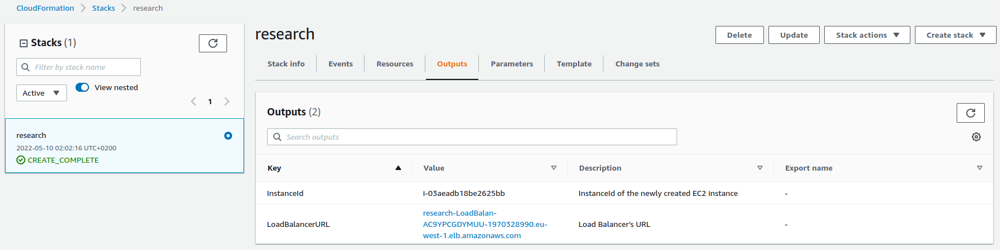

# AWS CloudFormation Tutorial

The aim of this research project is to learn how **AWS CloudFormation** works and create a hands-on tutorial that puts
in practice the theory learned. [AWS CloudFormation](https://docs.aws.amazon.com/whitepapers/latest/introduction-devops-aws/aws-cloudformation.html)
is an Infrastructure as a Code service that lets you automate the creation and deployment of AWS resources. 
To create the templates we can use either JSON or YAML. In this research project we will create the template using the YAML definition.

In the YAML file we will specify:
- An **EC2 instance** with a *private key*, a *public IP address* and *security group* attached to it. The instance will 
also start with Apache already installed.  
- An **Elastic Load Balancer** that will be used to access the port 80 (through a *security group*) of the EC2 instance.

<!-- Explicar que es una stack a cloudformation -->

## Getting familiar with AWS CloudFormation 
In order to get familiar with CloudFormation, first we are going to create a basic stack that deploys an EC2 instance 
with a security group. We can create it accessing [this link](https://eu-west-1.console.aws.amazon.com/cloudformation/designer/home?region=eu-west-1&templateURL=https%3A%2F%2Fs3.us-west-2.amazonaws.com%2Fcloudformation-templates-us-west-2%2FEC2InstanceWithSecurityGroupSample.template).

The link opens the AWS CloudFormation Designer in Ireland. We can see in the left panel named *Resource types* that there
are all the existing AWS resources listed, you can make a test and drag one into the right panel. On the right panel 
there is already a **EC2 -> Instance** and a **EC2 -> Security group** that are linked between them. If we move the mouse above the purple and pink circles that are 
around the resources, we can see that they are used to connect the resources between them. 

In the bottom panel we can see that the Designer is translating the resource allocation that we are creating into JSON 
and YAML. We can also add or modify resources by writing in that panel. 


The button next to *Close* in the top-left toolbar is the *Validate template* button. As its name says, it can be used 
to validate the template before creating the Stack. In this case, we are using a template that we know that works, 
but it can be useful when we are adding resources or creating the infrastructure from scratch. If you dragged a resource
earlier to play with the Designer, remove it before validating, or you will get an error. The one next to it in the 
left, with the Cloud symbol is the *Create stack* button. We click it to move on with the tutorial.


The Create Stack button moves us back to the *Create Stack* page, but this time the *Template is ready* option will be 
selected, and CloudFormation also lets us know that our template will be stored in S3. We click next and select 
`research-review` as name for the Stack.

The *Parameters* section lets us select which are the specific values of the resources of this Stack. Choose
1. IntanceType: `t2.micro`.
2. KeyName: choose one you have already created for other lab sessions.
3. SSHLocation: It is the IP address range that can be used to SSH to the EC2 instances. It can be your home or the UPC.

Create the Stack and wait for the resources to be allocated. When the creation is complete, we can access the *Resources*
tab and check the allocations. The *Template* tab shows the JSON code for the template. 


We can also check in the EC2 console that the Instance and the Security Group have been correctly created. 


We can now go back to the CloudFormation console and **Delete** the Stack.


# Creating our own template 
Another way to create the resources we need is to specify them in a YAML file. There are three main concepts that are 
necessary to create the stack.

### Parameters
In this section of the YAML file we are going to specify the parameters that the user can choose when using the template 
to create a stack using the interface. For this example we are going to use four different ones:
1. EC2 Instance type (*String*).
2. Name of the private key, it has to be created already, that will be used to access the EC2 (*AWS::EC2::KeyPair::KeyNam*e).
3. IP from which we will be able to access the EC2 via SSH (*String*).
4. Name of the security group that will be created and attached to the EC2 instance (*String*). 

Is important to remark that all the parameters have different filters (`allowed patterns` or `allowed values`) to verify that the field introduced will not give an error in the deployment of the infrastructure.
In more complex scenarios, this could be a handy tool in order to avoid further impossible or hard problems to solve. 

For example, the following code will allow the user to choose the type of EC2 Instance that will we deployed. The interface will show
a dropdown list with all the `AllowdValues`.  
```yaml
InstanceType:
    Description: WebServer EC2 instance type
    Type: String
    Default: t2.micro
    AllowedValues:
    - t3.nano
    - t3.micro
    - t3.small
    - t3.medium
    - t3.large
    - t3.xlarge
    - t3.2xlarge
    - t1.micro
    - t2.nano
    - t2.micro
    - t2.small
    - t2.medium
    - t2.large
    ConstraintDescription: must be a valid EC2 instance type.
```

### Resources
This section specifies all the AWS resources that are going to be created in the stack. In our case these are:
1. EC2 Instance.
2. Security group attached to the EC2.
3. Elastic Load Balancer, listening to port 80.
4. Security group attached to the ELB. 
5. Public IP address that will let us connect to the EC2. 

The following code is the specification of the EC2 instance, its Security Group, public IP address, Availability Zone and Image ID (ubuntu-18). The code will also install the python package in the EC2 instance by the linux commands. 
This is possible by specifying the linux commands to execute in the `UserData` parameter, is necessary to put also the following parameters `Fn::Base64: !Sub |` before the commands. Is important to highlight that th

Finally, the link between resources is made with the `!Ref` tag or `Ref: reference`.

```yaml
Resources:
  EC2Instance2:
    Type: AWS::EC2::Instance
    Properties:
      AvailabilityZone: eu-west-1a
      ImageId: ami-07d8796a2b0f8d29c
      InstanceType: 
        Ref: InstanceType
      SecurityGroups:
        - !Ref EC2SecurityGroup
      KeyName: !Ref KeyName
      UserData: 
        Fn::Base64: !Sub |
          #!/bin/bash
          sudo apt -y update
          sudo apt -y install python3      
  ELBSecurityGroup:
    Type: AWS::EC2::SecurityGroup
    Properties:
      GroupDescription: ELB Security Group
      SecurityGroupIngress:
      - IpProtocol: tcp
        FromPort: 80
        ToPort: 80
        CidrIp: 0.0.0.0/0
  EC2SecurityGroup:
    Type: AWS::EC2::SecurityGroup
    Properties:
      GroupDescription: !Ref SecurityGroupDescription
      SecurityGroupIngress:
      - IpProtocol: tcp
        FromPort: 80
        ToPort: 80
        SourceSecurityGroupId: 
          Fn::GetAtt:
          - ELBSecurityGroup
          - GroupId
      - IpProtocol: tcp
        FromPort: 22
        ToPort: 22
        CidrIp:
          Ref: SshIp
  LoadBalancerforEC2:
    Type: AWS::ElasticLoadBalancing::LoadBalancer
    Properties:
      AvailabilityZones: [eu-west-1a]
      Instances:
      - !Ref EC2Instance2
      Listeners:
      - LoadBalancerPort: '80'
        InstancePort: '80'
        Protocol: HTTP
      HealthCheck:
        Target: HTTP:80/
        HealthyThreshold: '3'
        UnhealthyThreshold: '5'
        Interval: '30'
        Timeout: '5'
      SecurityGroups:
        - !GetAtt ELBSecurityGroup.GroupId
  IPAddress:
    Type: AWS::EC2::EIP
```

### Outputs
This section specifies which will be the outputs of the Stack creation in the tab *Outputs*. In our case there are:
1. The ID of the EC2 instance. 
2. The public IP associated to the Instance.
3. The ELB URL. 

The way to get some values like from the elements deployed, like the URL, Name, etc. is by using the `!GetAtt element.field` tag further information in [this link](https://docs.aws.amazon.com/es_es/AWSCloudFormation/latest/UserGuide/intrinsic-function-reference-getatt.html).

```yaml
Outputs:
  InstanceId:
    Description: InstanceId of the newly created EC2 instance
    Value:
      Ref: EC2Instance2
  InstanceIPAddress:
    Description: IP address of the newly created EC2 instance
    Value:
      Ref: IPAddress
  LoadBalancerURL:
    Description: Load Balancer's URL
    Value: !GetAtt LoadBalancerforEC2.DNSName
```

To upload our YAML file we have to go to the CloudFormation service in AWS. Then we go to stack and, we create a new one uploading a template file.


Once we upload our template we have to fill all the parameters specified in the YAML file. And we select *Next* till we create the stack.


While the stack is being created the AWS will provide logs for all the steps in order to detect possible failures. Everything should go *blue* or *green* to have a good deployment.


If the creation of the stack it is successful we can check the output messages in the *Outputs* tab.



As we can see in the following image the EC2Instance is running perfectly.


Now that the EC2Instance is running, we will check if we can connect to it through the IP specified in the `SshIp` parameter.


We can check also that the python package has been installed successfully.


Finally, we will check if the Load Balancer is running with the parameters specified.


You can find the complete YAML template file in [research.yaml](templates/research.yaml). Take a deep look at it and try 
to understand how all the resources are created and linked among them. 

#### Q1: Code a YAML file that creates an EC2Instance with Apache installed and test if it is working. Upload your README.md and your YAML code with the respective images.

#### Q2: Code a YAML file that creates a Load Balancer that redirect the traffic from port 80 to the EC2Instance. The EC2Instance will only listen from port 80 and from the security group of the Load Balancer. Upload your README.md and your YAML code with the respective images.


